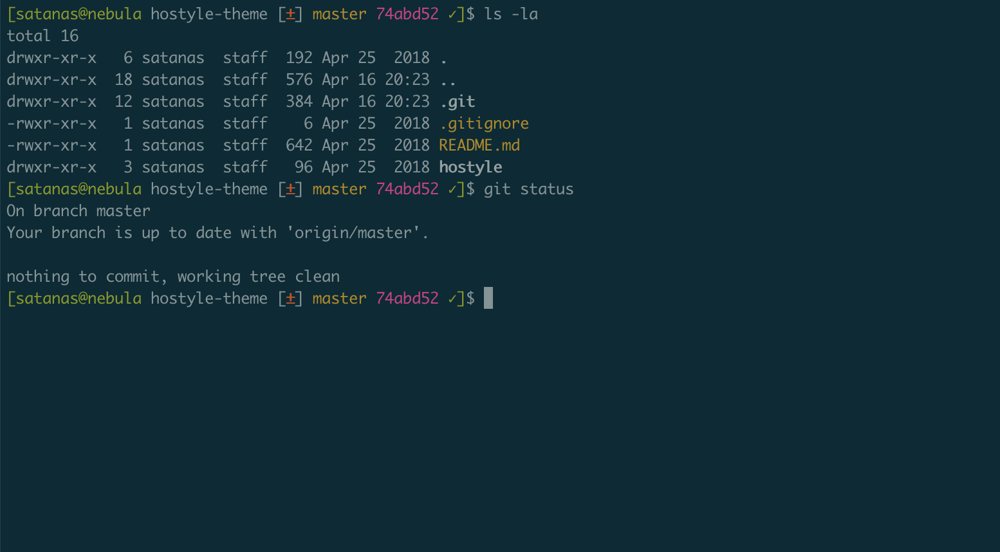

Hostyle Theme For Your Shell
==

This is my personal theme for [bash-it](https://github.com/revans/bash-it) and [oh-my-zsh](https://ohmyz.sh/). It's a mixture of simplicity and functionality.



For a git folder it looks like:
```
[user@host current_directory ± git_branch git_sha ✗]$
```

For a non-git folder it looks like:
```
[user@host current_directory]$
```

The git information only appears when you are in a git folder. Follow the instructiones below to install it.

Installation for Bash-It
===

```
git clone git://github.com/satanas/hostyle-theme.git ~/hostyle-theme
ln -s ~/hostyle-theme/bash-it/hostyle ~/.bash_it/themes/
```

Edit your `~/.bashrc` to include:
```
BASH_IT_THEME="hostyle"
```

Then, reload your shell:
```
source ~/.bashrc
```

Installation for Oh-My-Zsh
===

```
git clone git://github.com/satanas/hostyle-theme.git ~/hostyle-theme
ln -s ~/hostyle-theme/oh-my-zsh/hostyle.zsh-theme ~/.oh-my-zsh/themes/
```

Edit your `~/.zshrc` to include:
```
ZSH_THEME="hostyle"
```

Then, reload your shell:
```
source ~/.zshrc
```

Suggestions are welcome
